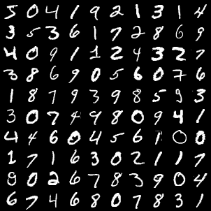
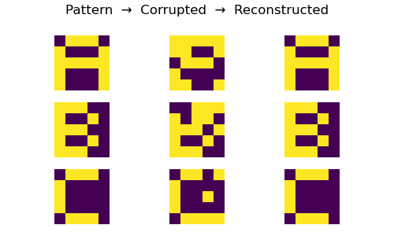
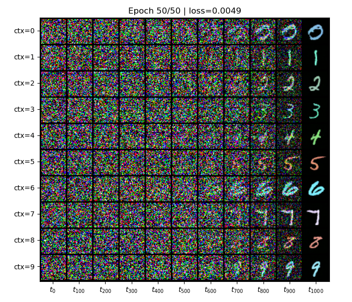

# Deep learning from scratch

> "What I cannot create, I do not understand." -- Richard Feynman

I agree.


---
Clean code implementation of the foundational deep learning layers, optimizers and models
* using PyTorch's autograd for the backpropagation
* using PyTorch's tensors for GPU computation
---

<br>

## Building blocks

<table>
    <tr>
        <td width="300">
            <code><a href="src/lib/layers.py">lib.layers</a></code>
        </td>
        <td>
            Linear<br>
            Embedding<br>
            BatchNorm&nbsp;<sup><a href="#ref1" title="Batch Normalization: Accelerating Deep Network Training by Reducing Internal Covariate Shift">1</a></sup><br>
            BatchNorm1d<br>
            BatchNorm2d<br>
            LayerNorm&nbsp;<sup><a href="#ref2" title="Layer Normalization">2</a></sup><br>
            RMSNorm&nbsp;<sup><a href="#ref3" title="Root Mean Square Layer Normalization">3</a></sup><br>
            LocalResponseNorm&nbsp;<sup><a href="#ref4" title="ImageNet Classification with Deep Convolutional Neural Networks">4</a></sup><br>
            Dropout&nbsp;<sup><a href="#ref5" title="Dropout: A Simple Way to Prevent Neural Networks from Overfitting">5</a></sup><br>
            RNN_cell<br>
            LSTM_cell&nbsp;<sup><a href="#ref6" title="Generating Sequences With Recurrent Neural Networks">6</a></sup><br>
            GRU_cell<br>
            RNN<br>
            Conv2d<br>
            ConvTranspose2d<br>
        </td>
        <td>
            Conv2dGroups<br>
            Pool2d<br>
            MaxPool2d<br>
            AvgPool2d<br>
            BatchAddPool<br>
            SEGate&nbsp;<sup><a href="#ref7" title="Squeeze-and-Excitation Gate layer">7</a></sup><br>
            Graph_cell<br>
            GCN_cell&nbsp;<sup><a href="#ref8" title="Semi-Supervised Classification with Graph Convolutional Networks">8</a></sup><br>
            GraphSAGE_cell&nbsp;<sup><a href="#ref9" title="Inductive Representation Learning on Large Graphs">9</a></sup><br>
            DiffPool&nbsp;<sup><a href="#ref10" title="Hierarchical Graph Representation Learning with Differentiable Pooling">10</a></sup><br>
            ReLU<br>
            GELU&nbsp;<sup><a href="#ref11" title="Gaussian Error Linear Units (GELUs)">11</a></sup><br>
            GLU&nbsp;<sup><a href="#ref12" title="Language Modeling with Gated Convolutional Networks">12</a></sup><br>
            SwiGLU&nbsp;<sup><a href="#ref13" title="GLU Variants Improve Transformer">13</a></sup><br>
            <br>
        </td>
        <td>
            Flatten<br>
            DotProductAttention<br>
            AdditiveAttention&nbsp;<sup><a href="#ref14" title="Neural Machine Translation by Jointly Learning to Align and Translate">14</a></sup><br>
            DiagBlockAttention&nbsp;<sup><a href="#ref15" title="Generating Long Sequences with Sparse Transformers">15</a></sup><br>
            ColumnBlockAttention&nbsp;<sup><a href="#ref15" title="Generating Long Sequences with Sparse Transformers">15</a></sup><br>
            MultiHeadAttention&nbsp;<sup><a href="#ref16" title="Attention Is All You Need">16</a></sup><br>
            GroupedQueryAttention&nbsp;<sup><a href="#ref17" title="GQA: Training Generalized Multi-Query Transformer Models from Multi-Head Checkpoints">17</a></sup><br>
            RelativeWindowAttention<br>
            SparseMultiHeadAttention&nbsp;<sup><a href="#ref15" title="Generating Long Sequences with Sparse Transformers">15</a></sup><br>
            KVCache<br>
            PositionalEncoding&nbsp;<sup><a href="#ref16" title="Attention Is All You Need">16</a></sup><br>
            RotaryEncoding&nbsp;<sup><a href="#ref18" title="RoFormer: Enhanced Transformer with Rotary Position Embedding">18</a></sup><br>
            PatchEmbedding&nbsp;<sup><a href="#ref19" title="An Image is Worth 16x16 Words: Transformers for Image Recognition at Scale">19</a></sup><br>
            RelativePositionBias2d&nbsp;<sup><a href="#ref20" title="Swin Transformer: Hierarchical Vision Transformer using Shifted Windows">20</a></sup><br>
            <br>
        </td>
    </tr>
    <tr>
        <td>
            <code><a href="src/lib/autoencoders.py">lib.autoencoders</a></code>
        </td>
        <td>
            MatrixFactorization<br>
        </td>
        <td>
            AutoencoderLinear<br>
        </td>
        <td>
            Word2Vec&nbsp;<sup><a href="#ref21" title="Efficient Estimation of Word Representations in Vector Space">21</a></sup><br>
        </td>
    </tr>
    <tr>
        <td>
            <code><a href="src/lib/optimizers.py">lib.optimizers</a></code>
        </td>
        <td>
            Optimizer<br>
            SGD<br>
            SGD_Momentum<br>
            AdaGrad<br>
        </td>
        <td>
            RMSProp<br>
            AdaDelta<br>
            Adam<br>
            AdamW&nbsp;<sup><a href="#ref22" title="Decoupled Weight Decay Regularization">22</a></sup><br>
        </td>
        <td>
            LR_Scheduler<br>
            LR_StepScheduler<br>
            LR_PlateauScheduler<br>
            LR_CosineDecayScheduler<br>
        </td>
    </tr>
    <tr>
        <td>
            <code><a href="src/lib/regularizers.py">lib.regularizers</a></code>
        </td>
        <td>
            L2_regularizer<br>
            L1_regularizer<br>
        </td>
        <td>
            elastic_regularizer<br>
            max_norm_constraint_<br>
        </td>
        <td>
            grad_clip_<br>
            grad_clip_norm_<br>
        </td>
    </tr>
</table>


<br>

## Models / Networks

<table>
    <tr>
        <th width="300">Family</th>
        <th>Models</th>
    </tr>
    <tr>
        <td>
            <code><a href="src/models/shallow_models.py">models.shallow_models</a></code>
        </td>
        <td>
            Perceptron, 
            SVM, 
            LeastSquareRegression, 
            LogisticRegression, 
            MulticlassPerceptron, 
            MulticlassSVM, 
            MultinomialLogisticRegression
        </td>
    </tr>
    <tr>
        <td>
            <code><a href="src/models/energy_based_models.py">models.energy_based_models</a></code>
        </td>
        <td>
            HopfieldNetwork, 
            HopfieldNetworkOptimized, 
            RestrictedBoltzmannMachine
        </td>
    </tr>
    <tr>
        <td>
            <code><a href="src/models/recurrent_networks.py">models.recurrent_networks</a></code>
        </td>
        <td>
            RNN_factory, 
            SimpleRNN, 
            LSTM&nbsp;<sup><a href="#ref6" title="Generating Sequences With Recurrent Neural Networks">6</a></sup>, 
            GRU, 
            LangModel, 
            EchoStateNetwork, 
            Encoder, 
            Decoder, 
            Seq2Seq&nbsp;<sup><a href="#ref23" title="Sequence to Sequence Learning with Neural Networks">23</a></sup>
        </td>
    </tr>
    <tr>
        <td>
            <code><a href="src/models/convolutional_networks.py">models.convolutional_networks</a></code>
        </td>
        <td>
            SimpleCNN, 
            SimpleFullyCNN, 
            LeNet5&nbsp;<sup><a href="#ref24" title="Gradient-based learning applied to document recognition">24</a></sup>, 
            AlexNet&nbsp;<sup><a href="#ref4" title="ImageNet Classification with Deep Convolutional Neural Networks">4</a></sup>, 
            NetworkInNetwork&nbsp;<sup><a href="#ref25" title="Network In Network">25</a></sup>, 
            VGG16&nbsp;<sup><a href="#ref26" title="Very Deep Convolutional Networks for Large-Scale Image Recognition">26</a></sup>, 
            GoogLeNet&nbsp;<sup><a href="#ref27" title="Going deeper with convolutions">27</a></sup>, 
            DeepPlainCNN
        </td>
    </tr>
    <tr>
        <td>
            <code><a href="src/models/residual_networks.py">models.residual_networks</a></code>
        </td>
        <td>
            ResNet34&nbsp;<sup><a href="#ref28" title="Deep Residual Learning for Image Recognition">28</a></sup>, 
            ResNet50&nbsp;<sup><a href="#ref28" title="Deep Residual Learning for Image Recognition">28</a></sup>, 
            ResNeXt50&nbsp;<sup><a href="#ref29" title="Aggregated Residual Transformations for Deep Neural Networks">29</a></sup>, 
            SEResNet50&nbsp;<sup><a href="#ref30" title="Squeeze-and-Excitation Networks">30</a></sup>, 
            SEResNeXt50&nbsp;<sup><a href="#ref30" title="Squeeze-and-Excitation Networks">30</a></sup>, 
            DenseNet121&nbsp;<sup><a href="#ref31" title="Densely Connected Convolutional Networks">31</a></sup>, 
            UNet_DDPM
        </td>
    </tr>
    <tr>
        <td>
            <code><a href="src/models/blocks/convolutional_blocks.py">models.blocks.convolutional_blocks</a></code>
        </td>
        <td>
            Inception&nbsp;<sup><a href="#ref27" title="Going deeper with convolutions">27</a></sup>, 
            ResBlock&nbsp;<sup><a href="#ref28" title="Deep Residual Learning for Image Recognition">28</a></sup>, 
            ResBottleneckBlock&nbsp;<sup><a href="#ref28" title="Deep Residual Learning for Image Recognition">28</a></sup>, 
            ResNeXtBlock&nbsp;<sup><a href="#ref29" title="Aggregated Residual Transformations for Deep Neural Networks">29</a></sup>, 
            DenseLayer&nbsp;<sup><a href="#ref31" title="Densely Connected Convolutional Networks">31</a></sup>, 
            DenseBlock&nbsp;<sup><a href="#ref31" title="Densely Connected Convolutional Networks">31</a></sup>, 
            DenseTransition&nbsp;<sup><a href="#ref31" title="Densely Connected Convolutional Networks">31</a></sup>
        </td>
    </tr>
    <tr>
        <td>
            <code><a href="src/models/graph_networks.py">models.graph_networks</a></code>
        </td>
        <td>
            GCN&nbsp;<sup><a href="#ref8" title="Semi-Supervised Classification with Graph Convolutional Networks">8</a></sup>, 
            GraphSAGE&nbsp;<sup><a href="#ref9" title="Inductive Representation Learning on Large Graphs">9</a></sup>, 
            GIN&nbsp;<sup><a href="#ref32" title="How Powerful are Graph Neural Networks?">32</a></sup>, 
            DiffPoolNet&nbsp;<sup><a href="#ref10" title="Hierarchical Graph Representation Learning with Differentiable Pooling">10</a></sup>
        </td>
    </tr>
    <tr>
        <td>
            <code><a href="src/models/attention_networks.py">models.attention_networks</a></code>
        </td>
        <td>
            RecurrentAttention&nbsp;<sup><a href="#ref33" title="Recurrent Models of Visual Attention">33</a></sup>, 
            SpatialTransformer&nbsp;<sup><a href="#ref34" title="Spatial Transformer Networks">34</a></sup>, 
            SpatialTransformerNet, 
            AttentionEncoder&nbsp;<sup><a href="#ref14" title="Neural Machine Translation by Jointly Learning to Align and Translate">14</a></sup>, 
            AttentionDecoder&nbsp;<sup><a href="#ref14" title="Neural Machine Translation by Jointly Learning to Align and Translate">14</a></sup>, 
            BahdanauAttention&nbsp;<sup><a href="#ref14" title="Neural Machine Translation by Jointly Learning to Align and Translate">14</a></sup>
        </td>
    </tr>
    <tr>
        <td>
            <code><a href="src/models/transformer_networks.py">models.transformer_networks</a></code>
        </td>
        <td>
            TransformerEncoderLayer, 
            TransformerEncoder, 
            TransformerDecoderLayer, 
            TransformerDecoder, 
            Transformer&nbsp;<sup><a href="#ref16" title="Attention Is All You Need">16</a></sup>, 
            GPT_TransformerBlock&nbsp;<sup><a href="#ref35" title="Language Models are Unsupervised Multitask Learners">35</a></sup>, 
            GPT_SparseTransformerBlock&nbsp;<sup><a href="#ref15" title="Generating Long Sequences with Sparse Transformers">15</a></sup>, 
            GPT2&nbsp;<sup><a href="#ref35" title="Language Models are Unsupervised Multitask Learners">35</a></sup>, 
            GPT3&nbsp;<sup><a href="#ref36" title="Language Models are Few-Shot Learners">36</a></sup>, 
            LLaMA_TransformerBlock&nbsp;<sup><a href="#ref37" title="LLaMA: Open and Efficient Foundation Language Models">37</a></sup>, 
            LLaMA1&nbsp;<sup><a href="#ref37" title="LLaMA: Open and Efficient Foundation Language Models">37</a></sup>, 
            LLaMA2&nbsp;<sup><a href="#ref38" title="Llama 2: Open Foundation and Fine-Tuned Chat Models">38</a></sup>, 
            LLaMA3&nbsp;<sup><a href="#ref39" title="The Llama 3 Herd of Models">39</a></sup>
        </td>
    </tr>
    <tr>
        <td>
            <code><a href="src/models/visual_transformers.py">models.visual_transformers</a></code>
        </td>
        <td>
            VisionTransformer&nbsp;<sup><a href="#ref19" title="An Image is Worth 16x16 Words: Transformers for Image Recognition at Scale">19</a></sup>, 
            VisionTransformerConvStem&nbsp;<sup><a href="#ref40" title="Early Convolutions Help Transformers See Better">40</a></sup>, 
            SwinTransformerBlock&nbsp;<sup><a href="#ref20" title="Swin Transformer: Hierarchical Vision Transformer using Shifted Windows">20</a></sup>, 
            SwinTransformer&nbsp;<sup><a href="#ref20" title="Swin Transformer: Hierarchical Vision Transformer using Shifted Windows">20</a></sup>
        </td>
    </tr>
    <tr>
        <td>
            <code><a href="src/models/diffusion_models.py">models.diffusion_models</a></code>
        </td>
        <td>
            DenoiseDiffusion&nbsp;<sup><a href="#ref41" title="Denoising Diffusion Probabilistic Models">41</a></sup>
        </td>
    </tr>
</table>


<br>

## Example usages & experiments


<table>
    <tr>
        <td width="230">
            <code><a href="examples/shallow">examples/shallow</a></code>
        </td>
        <td>
            Binary classification<br/> 
            Multi-class classification<br/> 
            Matrix factorization<br/> 
            MNIST classification<br/> 
            Visualize optimizers
        </td>
        <td width="300">
            
            
            
            
            
        </td>
    </tr>
    <tr>
        <td>
            <code><a href="examples/energy_based">examples/energy_based</a></code>
        </td>
        <td>
            Memorize patterns with Hopfield<br/> 
            Memorize more - optimized Hopfield<br/> 
            Memorize with RBM
        </td>
        <td>
            
            
            
        </td>
    </tr>
    <tr>
        <td>
            <code><a href="examples/recurrent">examples/recurrent</a></code>
        </td>
        <td>
            Predict next character<br/> 
            Predict masked words<br/> 
            Translate English to French<br/> 
            word2vec embeddings
        </td>
        <td>
            
            
            
            
        </td>
    </tr>
    <tr>
        <td>
            <code><a href="examples/convolutional">examples/convolutional</a></code>
        </td>
        <td>
            Image classification<br/> 
            Feature maps visualization<br/> 
            Saliency maps visualization
        </td>
        <td>
            
            
            
        </td>
    </tr>
    <tr>
        <td>
            <code><a href="examples/graph">examples/graph</a></code>
        </td>
        <td>
            Classify nodes in a graph<br/> 
            Classify protein graphs
        </td>
        <td>
            
            
        </td>
    </tr>
    <tr>
        <td>
            <code><a href="examples/attention">examples/attention</a></code>
        </td>
        <td>
            Recurrent visual attention<br/> 
            Translate  with additive attention
        </td>
        <td>
            
            
            
        </td>
    </tr>
    <tr>
        <td>
            <code><a href="examples/transformers">examples/transformers</a></code>
        </td>
        <td>
            Translate with Transformer<br/> 
            Predict next token (byte-pair)<br/> 
            Reproduce GPT-2 performance
        </td>
        <td>
            
            
            
            
        </td>
    </tr>
    <tr>
        <td>
            <code><a href="examples/diffusion">examples/diffusion</a></code>
        </td>
        <td>
            Generate colored digits
        </td>
        <td>
            
        </td>
    </tr>
</table>

<br>
<hr />
<br>

## References
1. <a name="ref1" href="https://proceedings.mlr.press/v37/ioffe15.pdf">Batch Normalization: Accelerating Deep Network Training by Reducing Internal Covariate Shift</a>
2. <a name="ref2" href="https://arxiv.org/pdf/1607.06450.pdf">Layer Normalization</a>
3. <a name="ref3" href="https://arxiv.org/pdf/1910.07467">Root Mean Square Layer Normalization</a>
4. <a name="ref4" href="https://proceedings.neurips.cc/paper/2012/file/c399862d3b9d6b76c8436e924a68c45b-Paper.pdf">ImageNet Classification with Deep Convolutional Neural Networks</a>
5. <a name="ref5" href="https://www.jmlr.org/papers/volume15/srivastava14a/srivastava14a.pdf">Dropout: A Simple Way to Prevent Neural Networks from Overfitting</a>
6. <a name="ref6" href="https://arxiv.org/pdf/1308.0850.pdf">Generating Sequences With Recurrent Neural Networks</a>
7. <a name="ref7" href="https://arxiv.org/pdf/1709.01507.pdf">Squeeze-and-Excitation Gate layer</a>
8. <a name="ref8" href="https://arxiv.org/pdf/1609.02907.pdf">Semi-Supervised Classification with Graph Convolutional Networks</a>
9. <a name="ref9" href="https://arxiv.org/pdf/1706.02216.pdf">Inductive Representation Learning on Large Graphs</a>
10. <a name="ref10" href="https://proceedings.neurips.cc/paper_files/paper/2018/file/e77dbaf6759253c7c6d0efc5690369c7-Paper.pdf">Hierarchical Graph Representation Learning with Differentiable Pooling</a>
11. <a name="ref11" href="https://arxiv.org/pdf/1606.08415v5">Gaussian Error Linear Units (GELUs)</a>
12. <a name="ref12" href="https://arxiv.org/pdf/1612.08083v3">Language Modeling with Gated Convolutional Networks</a>
13. <a name="ref13" href="https://arxiv.org/pdf/2002.05202">GLU Variants Improve Transformer</a>
14. <a name="ref14" href="https://arxiv.org/pdf/1409.0473.pdf">Neural Machine Translation by Jointly Learning to Align and Translate</a>
15. <a name="ref15" href="https://arxiv.org/pdf/1904.10509">Generating Long Sequences with Sparse Transformers</a>
16. <a name="ref16" href="https://proceedings.neurips.cc/paper_files/paper/2017/file/3f5ee243547dee91fbd053c1c4a845aa-Paper.pdf">Attention Is All You Need</a>
17. <a name="ref17" href="https://arxiv.org/pdf/2305.13245v3">GQA: Training Generalized Multi-Query Transformer Models from Multi-Head Checkpoints</a>
18. <a name="ref18" href="https://arxiv.org/pdf/2104.09864">RoFormer: Enhanced Transformer with Rotary Position Embedding</a>
19. <a name="ref19" href="https://arxiv.org/pdf/2010.11929">An Image is Worth 16x16 Words: Transformers for Image Recognition at Scale</a>
20. <a name="ref20" href="https://arxiv.org/pdf/2103.14030">Swin Transformer: Hierarchical Vision Transformer using Shifted Windows</a>
21. <a name="ref21" href="https://arxiv.org/pdf/1301.3781.pdf">Efficient Estimation of Word Representations in Vector Space</a>
22. <a name="ref22" href="https://arxiv.org/pdf/1711.05101">Decoupled Weight Decay Regularization</a>
23. <a name="ref23" href="https://arxiv.org/pdf/1409.3215">Sequence to Sequence Learning with Neural Networks</a>
24. <a name="ref24" href="https://hal.science/hal-03926082/document">Gradient-based learning applied to document recognition</a>
25. <a name="ref25" href="https://arxiv.org/pdf/1312.4400.pdf">Network In Network</a>
26. <a name="ref26" href="https://arxiv.org/pdf/1409.1556.pdf">Very Deep Convolutional Networks for Large-Scale Image Recognition</a>
27. <a name="ref27" href="https://arxiv.org/pdf/1409.4842.pdf?">Going deeper with convolutions</a>
28. <a name="ref28" href="https://arxiv.org/pdf/1512.03385.pdf">Deep Residual Learning for Image Recognition</a>
29. <a name="ref29" href="https://openaccess.thecvf.com/content_cvpr_2017/papers/Xie_Aggregated_Residual_Transformations_CVPR_2017_paper.pdf">Aggregated Residual Transformations for Deep Neural Networks</a>
30. <a name="ref30" href="https://arxiv.org/pdf/1709.01507.pdf">Squeeze-and-Excitation Networks</a>
31. <a name="ref31" href="https://openaccess.thecvf.com/content_cvpr_2017/papers/Huang_Densely_Connected_Convolutional_CVPR_2017_paper.pdf">Densely Connected Convolutional Networks</a>
32. <a name="ref32" href="https://arxiv.org/pdf/1810.00826v3.pdf">How Powerful are Graph Neural Networks?</a>
33. <a name="ref33" href="https://arxiv.org/pdf/1406.6247.pdf">Recurrent Models of Visual Attention</a>
34. <a name="ref34" href="https://arxiv.org/pdf/1506.02025.pdf">Spatial Transformer Networks</a>
35. <a name="ref35" href="https://cdn.openai.com/better-language-models/language_models_are_unsupervised_multitask_learners.pdf">Language Models are Unsupervised Multitask Learners</a>
36. <a name="ref36" href="https://arxiv.org/pdf/2005.14165">Language Models are Few-Shot Learners</a>
37. <a name="ref37" href="https://arxiv.org/pdf/2302.13971">LLaMA: Open and Efficient Foundation Language Models</a>
38. <a name="ref38" href="https://arxiv.org/pdf/2307.09288">Llama 2: Open Foundation and Fine-Tuned Chat Models</a>
39. <a name="ref39" href="https://arxiv.org/pdf/2407.21783">The Llama 3 Herd of Models</a>
40. <a name="ref40" href="https://arxiv.org/pdf/2106.14881">Early Convolutions Help Transformers See Better</a>
41. <a name="ref41" href="https://arxiv.org/pdf/2006.11239">Denoising Diffusion Probabilistic Models</a>

<br>

## Installation
### Local Setup
```
conda env create --name dev --file=./environment.yml
conda activate dev
source .env
```
### Docker Setup
```
docker build -t deep .
docker run --rm --gpus all --name deep deep
docker exec -it deep bash

# For debugging use:
docker run -v .:/deep-learning --rm --gpus all --name deep deep
```
