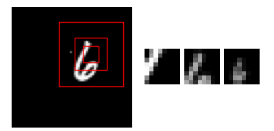

# Example usage of early attention models


<br>
<details>
    <summary>
        <code>python <a href="affine_mnist_spatial_transformer.py">affine_mnist_spatial_transformer.py</a></code>
    </summary>

```text
$ python examples/attention/affine_mnist_spatial_transformer.py
SpatialTransformerNet(): 40,880 parameters
Epoch 20/20: 100%|██████████| 49152/49152 [loss=0.221, acc=0.933 | val_loss=0.262, val_acc=0.918]
Test loss: 0.246 | Test acc: 0.926
```
</details>

<h3>Affine Spatial Transformer 
</h3>
Learns (context-specific) affine transformation to input images:<br>
<picture>
  <source media="(prefers-color-scheme: light)" srcset="https://math.vercel.app/?color=black&from=%5Cbegin%7Bpmatrix%7D%0Ax_i%5Es%20%5C%5C%0Ay_i%5Es%0A%5Cend%7Bpmatrix%7D%0A%3D%0AT_%5Ctheta%28G_i%29%0A%3D%0A%5Cbegin%7Bbmatrix%7D%0A%5Ctheta_%7B11%7D%20%26%20%5Ctheta_%7B12%7D%20%26%20%5Ctheta_%7B13%7D%20%20%5C%5C%0A%5Ctheta_%7B21%7D%20%26%20%5Ctheta_%7B22%7D%20%26%20%5Ctheta_%7B23%7D%0A%5Cend%7Bbmatrix%7D%0A%5Cbegin%7Bpmatrix%7D%0Ax_i%5Et%20%5C%5C%0Ay_i%5Et%20%5C%5C%0A1%0A%5Cend%7Bpmatrix%7D.svg">
  
</picture>
<br>

---

<br> 
<details>
    <summary>
        <code>python <a href="translated_mnist_attention_classification.py">translated_mnist_attention_classification.py</a></code>
    </summary>

```text
$ python examples/attention/translated_mnist_attention_classification.py
RecurrentAttention(): 490,764 parameters
	  1. Linear(192, 128, bias=True): 24,704 params
	  2. Linear(2, 128, bias=True): 384 params
	  3. Linear(256, 256, bias=True): 65,792 params
	  4. RNN_cell(256, 512, layer_norm=False): 393,728 params
	  5. Linear(512, 10, bias=True): 5,130 params
	  6. Linear(512, 2, bias=True): 1,026 params
Epoch 100/100: 100%|██████████| 49152/49152 [loss=0.493, acc=0.829 | val_loss=0.508, val_acc=0.827]
Test loss: 0.511 | Test acc: 0.820
```
</details>

<h3>Recurrent visual attention</h3>
Sequentially focus on the most important image regions (similarly to retina glimpses at different resolution)
<br><br><br>

---

<br>
<details>
    <summary>
        <code>python <a href="seq_to_seq_with_attention.py">seq_to_seq_with_attention.py</a></code>
    </summary>

```text
$ python examples/attention/seq_to_seq_with_attention.py
Data loading..
Using downloaded and verified file: ./data/text\fra-eng.zip
Extracting ./data/text\fra-eng.zip to ./data/text
Data preprocessing..
[en] TextVocabulary(size=12014)
[fr] TextVocabulary(size=21016)

Model: BahdanauAttention (11,106,072 params)
Epoch 100/100: 233472it [loss=0.305, acc=0.950]
what do you want to tell us ? (expected: qu'est-ce que vous voulez nous dire ?)
-> BLEU(n_grams=4): 0.000 | beam=(width=1,score=None) -> que veux-tu nous dire ?
-> BLEU(n_grams=4): 0.000 | beam=(width=2,score=-0.2954126200464488) -> que veux-tu nous dire ?
-> BLEU(n_grams=4): 0.000 | beam=(width=3,score=-0.2954126200464488) -> que veux-tu nous dire ?
\------------------------------------------
the swimmers are entering the water . <EOS> (expected: les nageurs entrent dans l'eau . <EOS>)
-> [with teacher forcing] les nageurs entrent dans l'eau . <EOS> . . . . . . . . .
```
</details>

<h3>Translate  with additive attention</h3> 
Dynamically focus on relevant parts of the input sentence during translation<br><br>
<picture>
  <source media="(prefers-color-scheme: light)" srcset="https://math.vercel.app/?color=black&from=a(\mathbf%20q%2C%20\mathbf%20k)%20=%20\mathbf%20w_v^\top%20\textrm{tanh}(\mathbf%20W_q\mathbf%20q%20%2B%20\mathbf%20W_k%20\mathbf%20k)">
  
</picture>
<br><br> 

