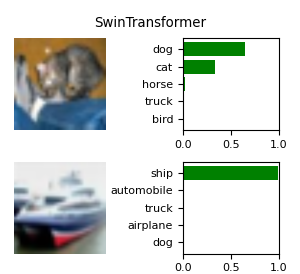
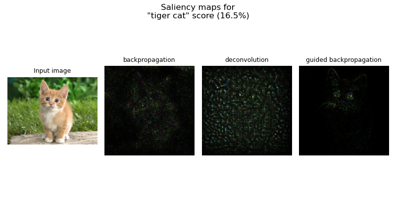

# Example usage of convolutional networks
<br>
<details>
    <summary>
        <code>python <a href="cifar10_classification.py">cifar10_classification.py</a></code>
    </summary>

```text
$ python examples/convolutional/cifar10_classification.py
Training samples: 48000 | Validation samples: 2000 | Test samples: 10000

Model: SimpleCNN(): 62,006 parameters
Epoch 10/10: 100% | [loss=1.349, acc=0.517 | val_loss=1.361, val_acc=0.526]
[Report only]: Test loss: 1.350 | Test acc: 0.516 | Failed on 75/157

Model: LeNet5(): 61,706 parameters
Epoch 10/10: 100% | [loss=1.689, acc=0.401 | val_loss=1.719, val_acc=0.374]
[Report only]: Test loss: 1.695 | Test acc: 0.394 | Failed on 95/157

Model: AlexNet(): 57,584,906 parameters
Epoch 10/10: 100% | [loss=0.284, acc=0.900 | val_loss=0.549, val_acc=0.823] 
[Report only]: Test loss: 0.573 | Test acc: 0.822 | Failed on 27/157

Model: NetworkInNetwork(): 2,015,398 parameters
Epoch 10/10: 100% | [loss=1.222, acc=0.555 | val_loss=1.882, val_acc=0.472]
[Report only]: Test loss: 1.885 | Test acc: 0.459 | Failed on 84/157

Model: VGG16(): 134,301,514 parameters
Epoch 10/10: 100% | [loss=0.063, acc=0.979 | val_loss=1.191, val_acc=0.787]
[Report only]: Test loss: 1.206 | Test acc: 0.777 | Failed on 35/157

Model: GoogLeNet(): 5,983,802 parameters
Epoch 10/10: 100% | [loss=0.888, acc=0.683 | val_loss=0.908, val_acc=0.661]
[Report only]: Test loss: 0.922 | Test acc: 0.674 | Failed on 51/157

Model: ResNet50(): 23,524,682 parameters
Epoch 10/10: 100% | [loss=0.122, acc=0.957 | val_loss=0.656, val_acc=0.808]
[Report only]: Test loss: 0.667 | Test acc: 0.818 | Failed on 28/157

Model: SEResNet50(): 26,039,626 parameters
Epoch 10/10: 100% | [loss=0.116, acc=0.960 | val_loss=0.730, val_acc=0.808]
[Report only]: Test loss: 0.745 | Test acc: 0.813 | Failed on 29/157

Model: SEResNeXt50(): 25,511,498 parameters
Epoch 10/10: 100% | [loss=0.108, acc=0.962 | val_loss=0.642, val_acc=0.826]
[Report only]: Test loss: 0.754 | Test acc: 0.805 | Failed on 30/157

Model: VisionTransformer(): 11,013,514 parameters
Epoch 10/10: 100% | [loss=0.758, acc=0.727 | val_loss=1.003, val_acc=0.652]
[Report only]: Test loss: 1.012 | Test acc: 0.654 | Failed on 54/157

Model: VisionTransformerConvStem(): 9,966,778 parameters
[Epoch 10/10: 100% | [loss=0.473, acc=0.831 | val_loss=0.868, val_acc=0.705]
[Report only]: Test loss: 0.854 | Test acc: 0.720 | Failed on 43/157

Model: SwinTransformer(): 42,797,014 parameters
Epoch 10/10: 100% | [loss=0.257, acc=0.909 | val_loss=1.017, val_acc=0.726]
[Report only]: Test loss: 1.046 | Test acc: 0.715 | Failed on 44/157
```
</details>

<h3>Image classification</h3>

- CNN (Simple) 
- LeNet-5
- AlexNet
- NetworkInNetwork (linear conv filter → micro network)
- VGG-16
- GoogLeNet (Inception blocks)
- ResNet-50 (residual network)
- SE-ResNet-50 (squeeze and excitation gate)
- SE-ResNeXt-50 (squeeze and excitation gate + aggregated residuals)
- VisionTransformer
- VisionTransformer (with convolutional stem)
- SwinTransformer (**S**hifted **win**dow )

<br>

---

<br>
<details>
    <summary>
        <code>python <a href="conv_viz_feature_maps.py">conv_viz_feature_maps.py</a></code>
    </summary>

```text
$ python examples/convolutional/conv_viz_feature_maps.py
Visualize the 3 filters of the last convolutional layer
```
</details>

<h3>Feature maps visualization</h3>
Visualize the convolutional filter maps
<br><br><br>

---

<br>
<details>
    <summary>
        <code>python <a href="conv_viz_saliency_maps.py">conv_viz_saliency_maps.py</a></code>
    </summary>

```text
$ python examples/convolutional/conv_viz_saliency_maps.py
Loading pretrained ResNet50 model..
Forward a single image input:
tiger cat: 16.525%
Generate saliency map: mode=backprop
Generate saliency map: mode=deconvnet
Generate saliency map: mode=guided_backprop
```
</details>

<h3>Saliency maps visualization</h3>
Gradient sensitivity over the input image pixels:<br><br>
<picture>
  <source media="(prefers-color-scheme: light)" srcset="https://math.vercel.app/?color=black&from=S_i=%20\frac%20{\partial%20h(\mathbf%20x)}{%20\partial%20x_i}">
  
</picture>
<br>

