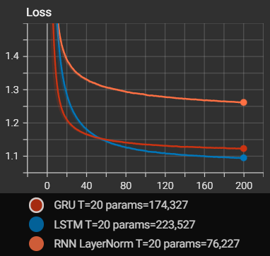
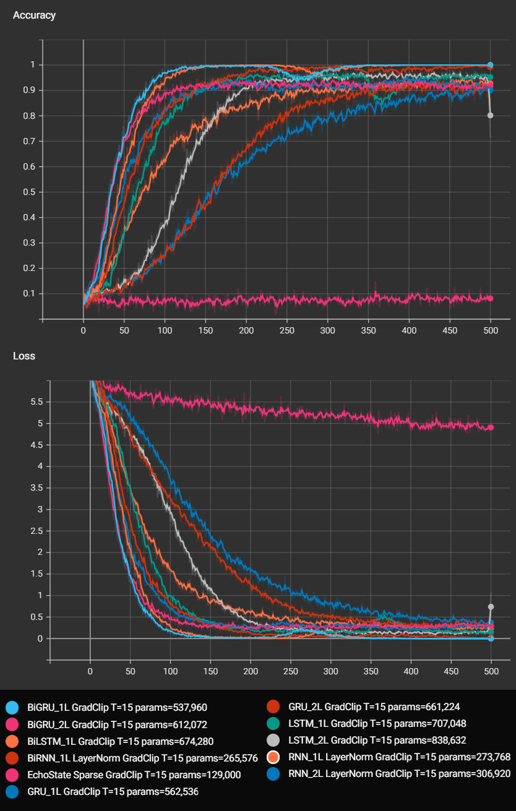

# Example usage of recurrent networks

<br>
<details>
    <summary>
        <code>python <a href="rnn_predict_next_char.py">rnn_predict_next_char.py</a></code>
    </summary>


```text
$ python examples/recurrent/rnn_predict_next_char.py
Data preprocessing..
TextVocabulary(size=177)
Fit 72495 sequences (with 20 tokens each) into

Model: RNN LayerNorm
EPOCH: 100%|██████████| 200/200 [cost=1.2617, perplexity=3.5313]
Sampling --------------------------------------------
-> [The simplest neural network]  in a single into contribed to
-> [random char] in the context of the traditional takes in the convolutions of interesting
the decoder small in the probabilistic reduced by using a single c

Model: LSTM
EPOCH: 100%|██████████| 200/200 [cost=1.0942, perplexity=2.9869]
Sampling --------------------------------------------
-> [The simplest neural network] s [41]. In the following recur
-> [random char] |F in the above similar to the output layers in the forward problems are
contained from the next steps in the vanishing and exploding gradient problem

Model: GRU
EPOCH: 100%|██████████| 200/200 [cost=1.1236, perplexity=3.0758]
Sampling --------------------------------------------
-> [The simplest neural network] s have simply set to the train
-> [random char] The use of a top-5 error to create an input layer to convergence, such as
the addition of the parameters of the identity activation functions
```
</details>



<h3>Predict next character</h3>
<picture>
  <source media="(prefers-color-scheme: light)" srcset="https://math.vercel.app/?color=black&from=\mathrm{P}(x_{t}%20\mid%20x_1%2C%20\ldots%2C%20x_{t-1})">
  
</picture>

- RNN (with LayerNorm)
- LSTM
- GRU

<br>

---

<br>
<details>
    <summary>
        <code>python <a href="rnn_masked_words.py">rnn_masked_words.py</a></code>
    </summary>

```text
$ python examples/recurrent/rnn_masked_words.py
Model: RNN_1L LayerNorm (273,768 params)
Test sequences: PASS | types of tasks. For [example,] computing the cube root of
EPOCH: 100%|██████████| 500/500 [accuracy=91.86%, cost=0.2701, perplexity=1.3100]

Model: RNN_2L LayerNorm (306,920 params)
Test sequences: PASS | a finite set of [input-output] pairs is referred to as model
EPOCH: 100%|██████████| 500/500 [accuracy=89.83%, cost=0.3926, perplexity=1.4808]

Model: BiRNN_1L LayerNorm (265,576 params)
Test sequences: PASS | to refer to artificial [neural] networks rather than biological
EPOCH: 100%|██████████| 500/500 [accuracy=99.42%, cost=0.0327, perplexity=1.0333]

Model: EchoState Sparse (129,000 params)
Test sequences: FAIL | loss is shown in [the] 1.6. This similarity <UNK> particularly
EPOCH: 100%|██████████| 500/500 [accuracy=8.43%, cost=4.9562, perplexity=142.0466]

Model: LSTM_1L (707,048 params)
Test sequences: FAIL | to a [neuron] separator between the two classes in linearly
EPOCH: 100%|██████████| 500/500 [accuracy=95.06%, cost=0.1454, perplexity=1.1565]

Model: LSTM_2L (838,632 params)
Test sequences: PASS | the brain truly works. Therefore, it [is] fair to suggest that
EPOCH: 100%|██████████| 500/500 [accuracy=71.22%, cost=1.0678, perplexity=2.9091]

Model: BiLSTM_1L (674,280 params)
Test sequences: PASS | such large data [sets.] These advances largely explain the
EPOCH: 100%|██████████| 500/500 [accuracy=100.00%, cost=0.0004, perplexity=1.0004]

Model: GRU_1L (562,536 params)
Test sequences: PASS | by connecting them in particular ways. [When] a neural network
EPOCH: 100%|██████████| 500/500 [accuracy=90.99%, cost=0.2909, perplexity=1.3376]

Model: GRU_2L (661,224 params)
Test sequences: PASS | on that example. By successively adjusting the [weights] between
EPOCH: 100%|██████████| 500/500 [accuracy=90.99%, cost=0.2895, perplexity=1.3358]

Model: BiGRU_1L (537,960 params)
Test sequences: PASS | with a weight, which affects the function [computed] at that
EPOCH: 100%|██████████| 500/500 [accuracy=100.00%, cost=0.0004, perplexity=1.0004]

Model: BiGRU_2L (612,072 params)
Test sequences: PASS | role as the [strengths] of synaptic connections in biological
EPOCH: 100%|██████████| 500/500 [accuracy=90.99%, cost=0.3505, perplexity=1.4197]
```
</details>

<h3>Predict masked words</h3> 
Train recurrent networks to predict randomly masked words in text sequences<br>
<picture>
  <source media="(prefers-color-scheme: light)" srcset="https://math.vercel.app/?color=black&from=\mathrm{P}(w_k%20\mid%20w_1%2C%20\ldots%2C%20w_{k-1}%2C\%2Cw_{k%2B1}%2C%20\ldots%2C%20w_T)">
  
</picture>

- EchoState (Sparsed)
- RNN
- LSTM
- GRU
- BiRNN (bidirectional)
- BiLSTM (bidirectional)
- BiGRU (bidirectional)

<br>

---

<br>
<details>
    <summary>
        <code>python <a href="seq_to_seq_lstm.py">seq_to_seq_lstm.py</a></code>
    </summary>

```text
$ python examples/recurrent/seq_to_seq_lstm.py
Data loading..
Using downloaded and verified file: ./data/text\fra-eng.zip
Extracting ./data/text\fra-eng.zip to ./data/text
Data preprocessing..
Seq2Seq(): 10,811,672 parameters
[en] TextVocabulary(size=12014)
[fr] TextVocabulary(size=21016)

Model: Seq2Seq (10,417,432 params)
Epoch 100/100: 233472it [loss=0.388, acc=0.940]
what do you want to tell us ? (expected: qu'est-ce que vous voulez nous dire ?)
-> BLEU(n_grams=4): 0.000 | beam=(width=1,score=None) -> qu'est-ce que tu veux nous dire ?
-> BLEU(n_grams=4): 0.000 | beam=(width=2,score=-0.26958) -> qu'est-ce que tu veux nous dire ?
-> BLEU(n_grams=4): 0.000 | beam=(width=3,score=-0.26958) -> qu'est-ce que tu veux nous dire ?
------------------------------------------
the swimmers are entering the water . <EOS> (expected: les nageurs entrent dans l'eau . <EOS>)
-> [with teacher forcing] les nageurs entrent dans l'eau . <EOS> théâtre . . . . . . . .
```
</details>

<h3>Translate English to French</h3>
Using Sequence to Sequence LSTM model<br>
<picture>
  <source media="(prefers-color-scheme: light)" srcset="https://math.vercel.app/?color=black&from=\mathrm{P}(y_1%2C%20\ldots%2C%20y_{T%27}%20\mid%20x_1%2C%20\ldots%2C%20x_T)%20=%20\prod_{t=1}^{T%27}%20\mathrm{P}(y_t%20\mid%20s%2C%20y_1%2C%20\ldots%2C%20y_{t-1})">
  
</picture>
<br><br><br>

--- 

<br>
<details>
    <summary>
        <code>python <a href="word2vec.py">word2vec.py</a></code>
    </summary>

```text
$ python examples/recurrent/word2vec.py
Data preprocessing..
[ 93 254   0   0   0   0   0   0   0   0   0   0   0   0   0] ->  first citizen:
[711   0   0   0   0   0   0   0   0   0   0   0   0   0   0] ->  all:
[112   2 112   3   0   0   0   0   0   0   0   0   0   0   0] ->  speak , speak .
[ 93 254   0   0   0   0   0   0   0   0   0   0   0   0   0] ->  first citizen:
100%|██████████| 6793/6793
targets: (21938,) | contexts: (21938, 5) | labels: (21938, 5) 

Fit 21938 training samples in word2vec model..
EPOCH: 100%|██████████| 1000/1000 [accuracy=0.787, cost=0.67]
```
</details>

<h3>word2vec embeddings</h3>
Learn fixed word embeddings using skip-gram with negative sampling<br>
<picture>
  <source media="(prefers-color-scheme: light)" srcset="https://math.vercel.app/?color=black&from=\prod_{t=1}^T%20\mathrm{P}(\mathrm{context}_t%20\mid%20w_t)\qquad%20\mathrm{context}_t%20=%20\{\%2Cw_{t%2Bj}%20:%20j%20\in%20[-m%2Cm]\setminus\{0\}\}">
  
</picture>


