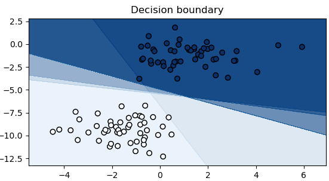
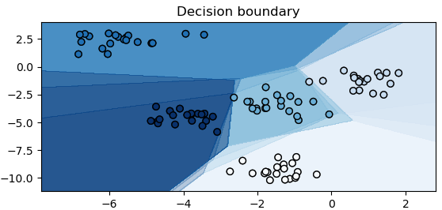
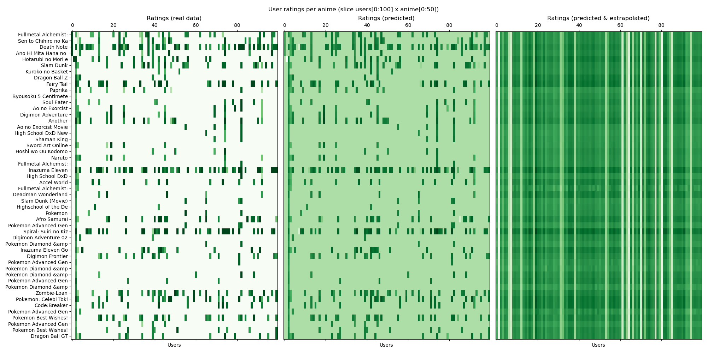

# Example usage of shallow models

<br>
<details>
    <summary>
        <code>python <a href="binary_classification.py">binary_classification.py</a></code>
    </summary>

```text
$ python examples/shallow/binary_classification.py
Perceptron            | steps #101 matched=100/100, cost=0.0 
SVM                   | steps #201 matched=100/100, cost=0.1494152545928955
LeastSquareRegression | steps #701 matched=100/100, cost=0.07472265511751175 
LogisticRegression    | steps #999 matched=100/100, cost=0.5538358092308044 
```
</details>

<h3>Binary classification</h3>

- Perceptron
- SVM
- LeastSquareRegression
- LogisticRegression
<br><br><br>

---

<br>
<details>
    <summary>
        <code>python <a href="multiclass_classification.py">multiclass_classification.py</a></code>
    </summary>

```text
$ python examples/shallow/multiclass_classification.py
MulticlassPerceptron           | steps #101 matched=98/100, cost=0.3650871515274048 
MulticlassSVM                  | steps #201 matched=99/100, cost=4.273800849914551
MultinomialLogisticRegression  | steps #999 matched=99/100, cost=5.703800678253174 
```
</details>

<h3>Multi-class classification</h3>

- MulticlassPerceptron
- MulticlassSVM
- MultinomialLogisticRegression
<br><br>

---


<br>
<details>
    <summary>
        <code>python <a href="matrix_factorization.py">matrix_factorization.py</a></code>
    </summary>

```text
$ python examples/shallow/matrix_factorization.py
Data preprocessing..
Using downloaded and verified file: ./data/anime\anime-ratings-dataset.zip
Extracting ./data/anime\anime-ratings-dataset.zip to ./data/anime
Fitting data to MatrixFactorization..
 - training data: 6337240 samples (633 batches with batch size 10000)
EPOCH: 100%|██████████| 50/50 [cost=2.37]
```
</details>

<h3>Matrix factorization</h3>
Matrix factorization for movie recommendations:<br> <br> 

<picture>
  <source media="(prefers-color-scheme: light)" srcset="https://math.vercel.app/?color=black&from=\underset{m\times%20n}{{\mathbf%20R}}%20\approx%20\underset{m\times%20k}{\mathbf%20U}%20\;\;\underset{k%20\times%20n}{\mathbf%20V^T}">
  
</picture>
<br>

---

<br>
<details>
    <summary>
        <code>python <a href="mnist_classification.py">mnist_classification.py</a></code>
    </summary>

```text
$ python examples/shallow/mnist_classification.py
Fit 51000 training samples in model: Net(): 297,710 parameters
EPOCH: 100%|██████████| 200/200 [accuracy=0.9803|0.9853, cost=0.0608|0.0476, lr=0.3]
[Report only]: test_accuracy=0.9843, test_cost=0.0508
[Report only]: Failed on 157 samples out of 10000
```
</details>

<h3>MNIST classification</h3> 
Classics - fit a simple feed forward network
<br><br><br><br><br><br>

---

<br>
<details>
    <summary>
        <code>python <a href="visualize_optimizers.py">visualize_optimizers.py</a></code>
    </summary>

```text
$ python examples/shallow/visualize_optimizers.py
Optimizing with SGD
Optimizing with SGD_Momentum
Optimizing with AdaGrad
Optimizing with RMSProp
Optimizing with AdaDelta
Optimizing with Adam
```
</details>

<h3>Visualize optimizers</h3>

- SGD
- SGD_Momentum
- AdaGrad
- RMSProp
- AdaDelta
- Adam
<br><br>

