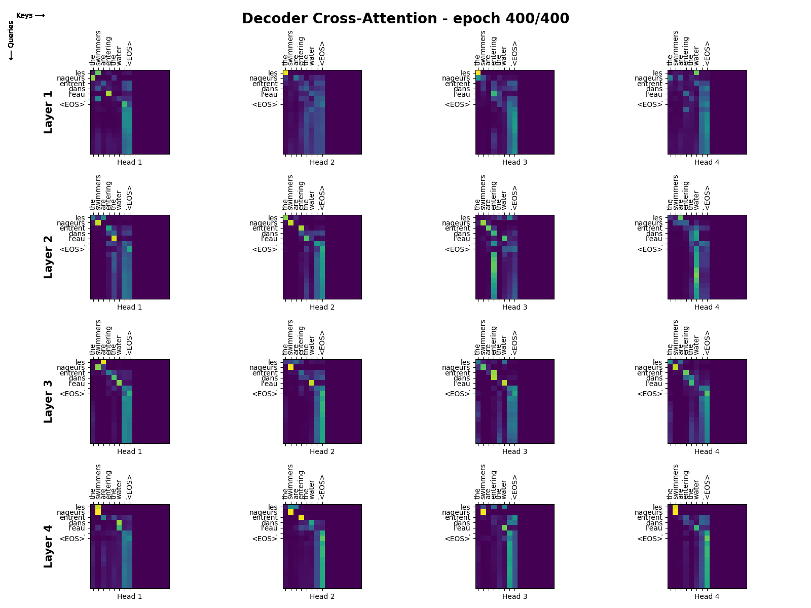
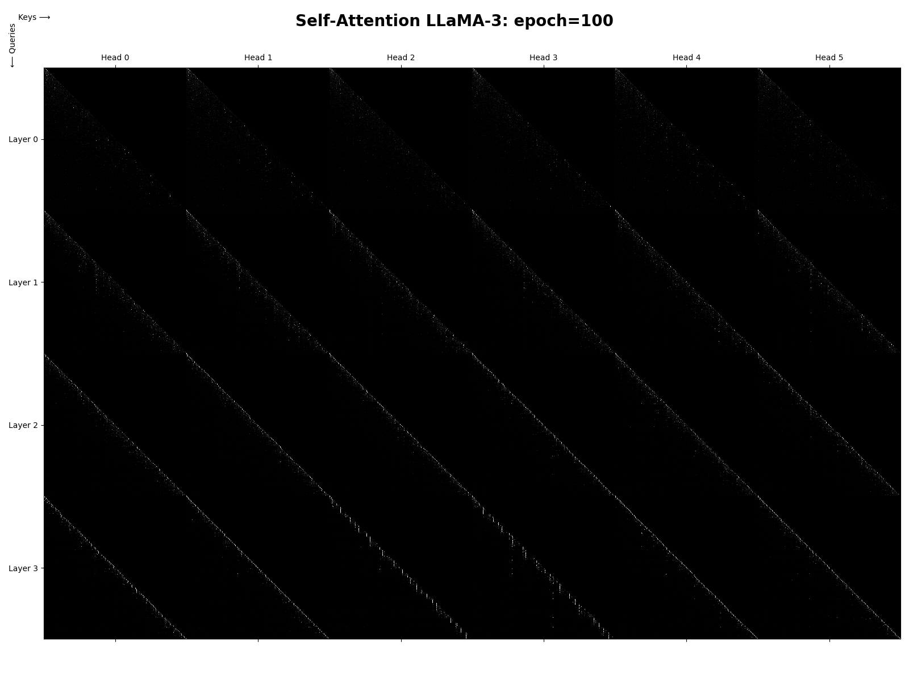
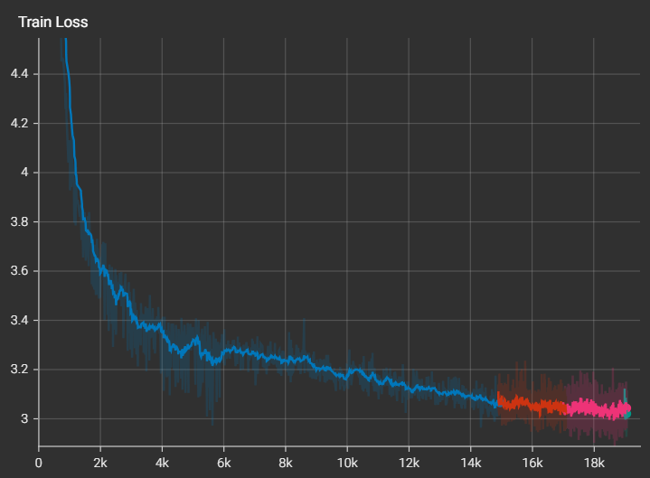

# Example usage of transformers

<br>
<details>
    <summary>
        <code>python <a href="seq_to_seq_with_transformer.py">seq_to_seq_with_transformer.py</a></code>
    </summary>


```text
$ python examples/transformers/seq_to_seq_with_transformer.py
Data loading..
Using downloaded and verified file: ./data/text\fra-eng.zip
Extracting ./data/text\fra-eng.zip to ./data/text
Data preprocessing..
[en] TextVocabulary(size=12014)
[fr] TextVocabulary(size=21016)

Model: Transformer (19,117,080 params)
Epoch 400/400: 233472it [loss=0.273, acc=0.953]
what do you want to tell us ? (expected: qu'est-ce que vous voulez nous dire ?)
-> BLEU(n_grams=4): 0.000 | beam=(width=1,score=None) -> qu'est-ce que tu veux nous dire ?
-> BLEU(n_grams=4): 0.000 | beam=(width=2,score=-0.22794640539652386) -> qu'est-ce que tu veux nous dire ?
-> BLEU(n_grams=4): 0.000 | beam=(width=3,score=-0.32747009584122644) -> qu'est-ce que tu nous dire ?
------------------------------------------
what does tom think of mary ? (expected: que pense tom de mary ?)
-> BLEU(n_grams=4): 1.000 | beam=(width=1,score=None) -> que pense tom de mary ?
-> BLEU(n_grams=4): 0.688 | beam=(width=2,score=-0.47913063548759405) -> que pense tom de marie ?
-> BLEU(n_grams=4): 1.000 | beam=(width=3,score=-0.3935343007379874) -> que pense tom de mary ?
------------------------------------------
what does this mean for tom ? (expected: qu'est-ce que cela signifie pour tom ?)
-> BLEU(n_grams=4): 0.276 | beam=(width=1,score=None) -> qu'est-ce que cela signifie pour tom signifie pour tom ? qu'est-ce que cela signifie pour tom
-> BLEU(n_grams=4): 0.368 | beam=(width=2,score=-0.1382956975130914) -> qu'est-ce que cela signifie pour tom ? qu'est-ce que cela signifie pour tom ?
-> BLEU(n_grams=4): 0.276 | beam=(width=3,score=-0.3921557664871216) -> qu'est-ce que signifie pour tom que cela signifie pour tom ? qu'est-ce que cela signifie pour
------------------------------------------
what else do we need to buy ? (expected: que devons-nous acheter d'autre ?)
-> BLEU(n_grams=4): 1.000 | beam=(width=1,score=None) -> que devons-nous acheter d'autre ?
-> BLEU(n_grams=4): 1.000 | beam=(width=2,score=-0.02699730700445709) -> que devons-nous acheter d'autre ?
-> BLEU(n_grams=4): 1.000 | beam=(width=3,score=-0.06095004131522437) -> que devons-nous acheter d'autre ?
------------------------------------------
what else do you plan to do ? (expected: que comptez-vous faire d'autre ?)
-> BLEU(n_grams=4): 1.000 | beam=(width=1,score=None) -> que comptez-vous faire d'autre ?
-> BLEU(n_grams=4): 1.000 | beam=(width=2,score=-0.042321138265855804) -> que comptez-vous faire d'autre ?
-> BLEU(n_grams=4): 1.000 | beam=(width=3,score=-0.04204202562502318) -> que comptez-vous faire d'autre ?
------------------------------------------
the swimmers are entering the water . <EOS> (expected: les nageurs entrent dans l'eau . <EOS>)
-> [with teacher forcing] les nageurs entrent dans l'eau . <EOS> . . . . . . . . .
```
</details>

<h3>Translate with Transformer</h3>
Train a Sequence to Sequence Transformer to translate English sentences to French<br><br>
<picture>
  <source media="(prefers-color-scheme: light)" srcset="https://math.vercel.app/?color=black&from=\text{Attention}(Q%2C%20K%2C%20V)%20=%20\mathrm{softmax}\left(%20\frac{Q%20K^\top}{\sqrt{d_k}}%20\right)V">
  
</picture>
<br><br><br>


---

<br>
<details>
    <summary>
        <code>python <a href="next_token_byte_pair.py">next_token_byte_pair.py</a></code>
    </summary>

```text
$ python examples/transformers/next_token_byte_pair.py
Data preprocessing..
Training BPE tokenizer:
BPE Merge 500/500: freq=211 (663, 334) -> 755
Encode data..
Split training data

-> Training GPT2(): 7,487,232 parameters
Epoch 100/100 | lr=1.02706e-05 | train_loss=2.0542 val_loss=3.4153 | train_acc=0.4815 val_acc=0.2880
ISABELLA:
Your husband! Camillo
[Now that we have learned how to work with probability];
And suck'd in all this vain bittering Jold,
And in the hotse pursued.
MONTAGUE:
Thou detest; then thy widows was dispersed still. What
That fair mother is a matter?

-> Training GPT3(): 7,487,232 parameters
Epoch 100/100 | lr=1.02706e-05 | train_loss=2.1050 val_loss=3.2339 | train_acc=0.4705 val_acc=0.3113
BUCKINGHAM:
Madam, you are baily witness herein:
A messenger, then the seat of men of courtent,
And slept for that nature of your mants,
Lell in the sea in hand of honour.

-> Training LLaMA1(): 7,661,952 parameters
Epoch 100/100 | lr=1.02706e-05 | train_loss=0.1030 val_loss=6.8255 | train_acc=0.9759 val_acc=0.2444
, is an English weep.
My friend Plantagenet, Siliar, reputation to alive,
And with his wife's greetings, as we are.
See that he sends herNow to bed;
The word and violate, was so pites hard to height.
More than the hirdTower.
KING RICHARD II:
Ay, but yet she's gone

-> Training LLaMA2(): 7,661,952 parameters
Epoch 100/100 | lr=1.02706e-05 | train_loss=0.0984 val_loss=6.7783 | train_acc=0.9769 val_acc=0.2519
Strike the drum.
FRIAR LAURENCE:
I will be brief, for my short date of breath
Is not so long as is a tedious tale.
Romeo, there dead, was husband to that Juliet;
And she, there dead, that Romeo's faithful wife:
I married them; and their stol'n marriage-day

-> Training LLaMA3(): 7,661,952 parameters
Epoch 100/100 | lr=1.02706e-05 | train_loss=0.0995 val_loss=6.7469 | train_acc=0.9766 val_acc=0.2523
SICINIUS:
We speak no more indocate:
Let me know the ground of heaven, you
not only chamberlary mask'd with her soul.
Second Murderer:
'Zounds, some p cannot go forward: what may I speak


```
</details>

<h3>Predict next token (byte-pair)</h3>

Train large foundational models to write poems, using byte-pair encoded tokens 

- GPT-2
- GPT-3 (with SparseBlock)
- LLaMA-1
- LLaMA-2 (with Grouped Query Attention)
- LLaMA-3

<br>

---

<br>
<details>
    <summary>
        <code>python <a href="reproduce_gpt.py">reproduce_gpt.py</a></code>
    </summary>

```text
$ docker run -it --rm --gpus all -v --name deep deep bash -c "python examples/transformers/reproduce_gpt.py"
Found 99 train shards and 1 val shards
Initial val loss: 10.9347
Compiling the model..
Training...
Step 1/19073: lr=8.39161e-07 | grad_norm=14.2035 | loss=10.939554 | tok/sek=56718.7 | duration=9.2 sec | ETA: 48h 58m 6s
Step 1/19073: val_loss=10.8874
[Neural networks are]matched Pensionivalhenscoinsouk Participants Ether parliament Continentaludgetbcitions psychiat¯¯¯¯ Omn additives fourfind referrals Originallyoffensive\\\\\\\\\\\\\\\\ restraints borders regressionFinishClub methods shareholder KOById Hi TJ maneu plasterouk Synt TimberwolvesLET Manualregon Blossom Book brawl hairs promises Corporation2017 audience
Saving checkpoint at step=1...
...
Step 19073/19073: lr=6.00000e-05 | grad_norm=0.2995 | loss=3.133242 | tok/sek=59049.4 | duration=8.9 sec | ETA: 0h 0m 0s
Step 19073/19073: val_loss=3.0372
[Neural networks are] the only type of brain function that consists of a complete two-electron population. It is this set of interconnected brain networks that provides a fundamental basis to our understanding of brain science, understanding, and communication.
Although the actual brain network is not
```
</details>


<h3>Reproduce GPT-2 performance</h3>

Highly optimized GPT-2 training procedure over FineWeb-Edu (10B tokens)

<br><br><br>


